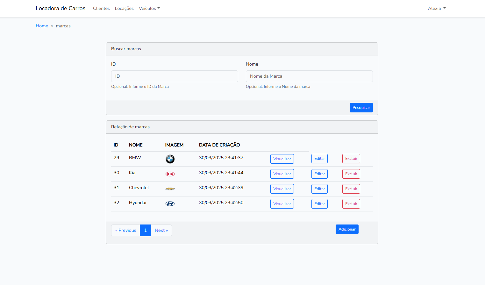

# LOCADORA DE CARROS

Simula um site de locadora de carros

**Em desenvolvimento**

> Laravel, php e vue.js. Banco de dados MySql

É possível baixar o arquivo **locadora.postman_collection.json** para importar as rotas do back-end no postman.

> Rotas protegidas pela autenticação jwt -> bearer token

## Ambiente de desenvolvimento

1. Composer install
2. cp .env.example .env
3. php artisan key:generate
4. ajustar variáveis env para conexão com o banco 
5. php artisan jwt:secret
6. npm install
7. npm run dev
8. php artisan storage:link
9. php artisan serve

## Telas

- login
- cadastro
- esqueci a senha
- home
- veículos -> marcas (adicionar, visualizar, editar, pesquisar e remover)

## Funcionalidades

Simulador de locadora de carros

- Marca
- Modelo
- Carro
- Cliente
- Locacao

Para cada um acima no backend é possível:

- Criar
- Pesquisar todos
- Pesquisar todos com filtros
- Pesquisar um
- Cadastrar
- Atualizar
- Excluir

Ainda há as rotas de:

1. login: devolve um token necessário para as rotas protegidas
2. logout: invalida o token
3. refresh: atualiza o token
4. me: traz informações não sensíveis do usuário logado

## Relacionamentos

- Uma marca pode ter 1 ou mais modelos
- Um modelo tem apenas uma marca
- Um carro tem apenas 1 modelo
- Uma locacao tem apenas 1 cliente
- Uma locacao tem apenas 1 carro
