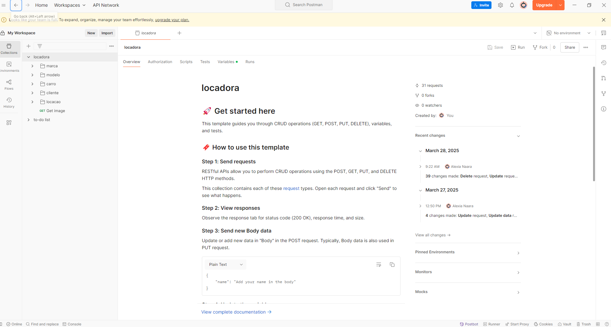

# API DE LOCADORA DE CARROS

A aplicação serve como um estudo de CRUD e criação de API com laravel php, não há interface apenas o back end. 

É possível acessar a documentação para importar no postman usando o arquivo **locadora.postman_collection.json**.

## Ambiente de desenvolvimento

1. Composer install
2. cp .env.example .env
3. php artisan key:generate
4. ajustar variáveis env para conexão com o banco 
5. php artisan jwt:secret

## Funcionalidades

Simulador de locadora de carros

- Marca
- Modelo
- Carro
- Cliente
- Locacao

Para cada um acima é possível:

- Criar
- Pesquisar todos
- Pesquisar todos com filtros
- Pesquisar um
- Cadastrar
- Atualizar
- Excluir

## Relacionamentos

- Uma marca pode ter 1 ou mais modelos
- Um modelo tem apenas uma marca
- Um carro tem apenas 1 modelo
- Uma locacao tem apenas 1 cliente
- Uma locacao tem apenas 1 carro
